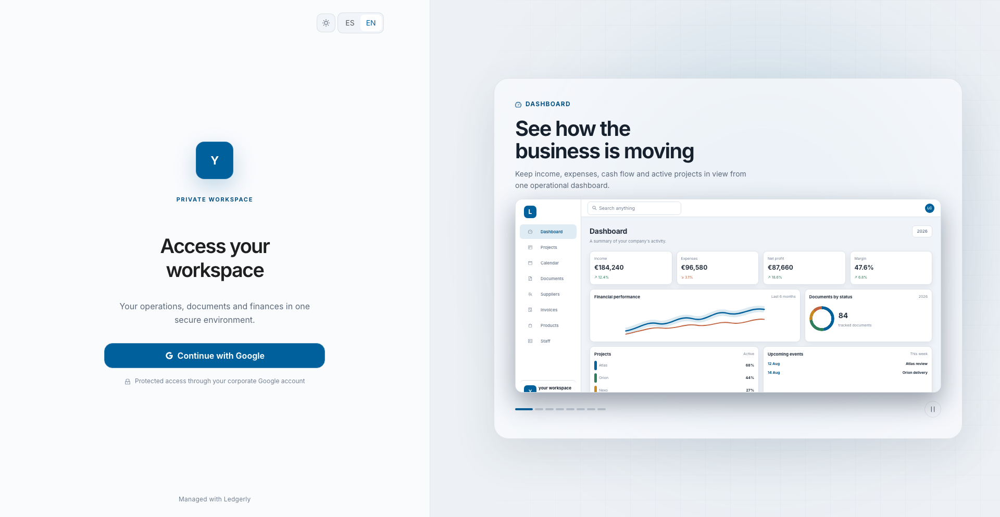
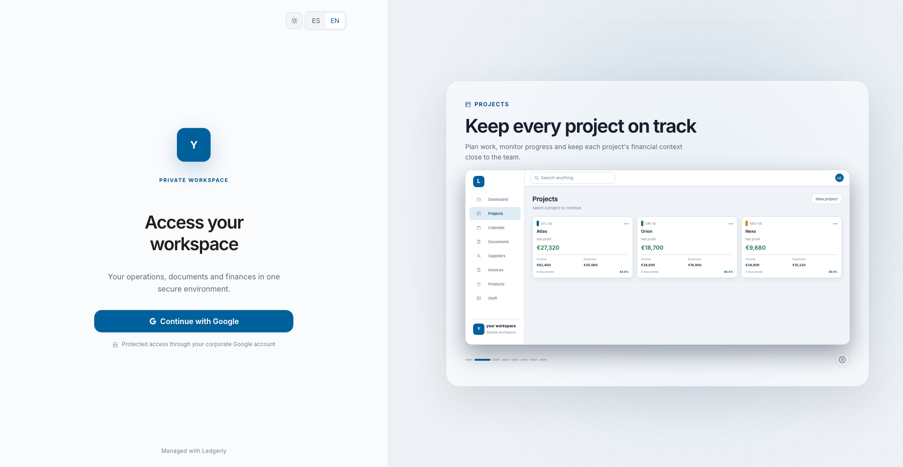
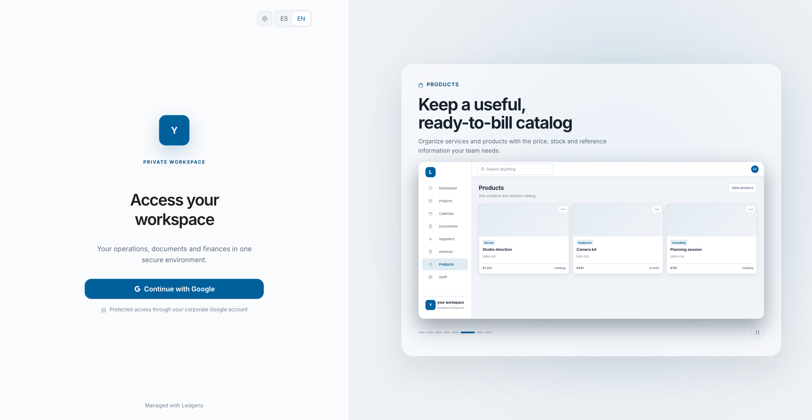

<div align="center">
  <a href="https://github.com/Davison27/ledgerly">
    
  </a>
  <h1>Ledgerly</h1>
  <p><strong>Your business, clearly connected.</strong></p>
  <p>An enterprise-grade, self-hosted operational workspace uniting projects, financials, encrypted documents, teams, and business decisions.</p>

  <p>
    <a href="#run-locally"></a>
    <a href="#run-locally"></a>
    <a href="#run-locally"></a>
    <a href="#security-by-design"></a>
    <a href="#install-on-a-vps"></a>
    
  </p>

  <p>
    <a href="#-why-ledgerly"><strong>Explore Features »</strong></a>
    ·
    <a href="#-product-tour"><strong>Product Tour</strong></a>
    ·
    <a href="#-run-locally"><strong>Quickstart</strong></a>
    ·
    <a href="#-install-on-a-vps"><strong>Deploy to VPS</strong></a>
    ·
    <a href="#-security-by-design"><strong>Security Architecture</strong></a>
    ·
    <a href="#-architecture"><strong>Architecture</strong></a>
  </p>
</div>

<br>

<div align="center">
  
</div>

<br>

---

## ⚡ Why Ledgerly?

Traditional business management is scattered across fragmented spreadsheets, invoice drives, and disconnected chat threads. Ledgerly brings everything into one cohesive, self-hosted operational command center:

<table>
  <tr>
    <td width="50%" valign="top">
      <h3>📊 Real-Time Financial Visibility</h3>
      <ul>
        <li><strong>Project-driven P&L:</strong> Live margin, income, and expense tracking directly mapped to work orders.</li>
        <li><strong>Multi-currency operations:</strong> Handle domestic and international transactions cleanly.</li>
        <li><strong>Cash-flow forecasting:</strong> Instant breakdown of pending VAT and projected expenses.</li>
      </ul>
    </td>
    <td width="50%" valign="top">
      <h3>📑 Intelligent Document Pipeline</h3>
      <ul>
        <li><strong>Automated OCR & Extraction:</strong> Parse incoming invoices (PDF, XML, Facturae, Factur-X, UBL) without manual data entry.</li>
        <li><strong>Smart duplicate prevention:</strong> Flag repeated bills and anomalous amounts automatically.</li>
        <li><strong>Full audit trail:</strong> Document lifecycle tracking with real-time alerts.</li>
      </ul>
    </td>
  </tr>
  <tr>
    <td width="50%" valign="top">
      <h3>🗓️ Unified Scheduling & Resource Planning</h3>
      <ul>
        <li><strong>Conflict detection:</strong> Prevent double-booking staff or equipment across overlapping projects.</li>
        <li><strong>Compliance timeline:</strong> Automatic tracking of employee document expiries and tax deadlines.</li>
        <li><strong>Multi-view calendar:</strong> Dense day, week, and agenda views tailored for rapid coordination.</li>
      </ul>
    </td>
    <td width="50%" valign="top">
      <h3>🛡️ Zero-Knowledge Encrypted Storage</h3>
      <ul>
        <li><strong>Authenticated AES-256-GCM:</strong> Confidential PDFs (compliance, equipment, employee records) encrypted at rest in PostgreSQL.</li>
        <li><strong>Versioned Keyring & Re-key CLI:</strong> Seamless key rotation and validation without downtime.</li>
        <li><strong>100% Data Sovereignty:</strong> No telemetry, no third-party cloud leaks—your database stays yours.</li>
      </ul>
    </td>
  </tr>
</table>

---

## 🖼️ Product Tour

| Project Portfolio & Margins | Equipment & Asset Management |
| :---: | :---: |
|  |  |
| *Track project health, budgets, and attached documentation in real time.* | *Manage machinery and tools, track rental rates, and store encrypted tech specs.* |

> The screenshots use a sanitized example workspace. An installation can apply its own company name, logo, and brand colour across the sign-in experience and authenticated application.

---

## 🔒 Security by Design

Ledgerly is built with defense-in-depth security principles:

- **Google Workspace & OAuth Access**: Authentication handled by Better Auth, coupled with Ledgerly's internal workspace authorization guard.
- **Granular RBAC**: Role-based access matrices (`none`, `view`, `edit`) across every business context with admin, editor, and viewer presets.
- **Envelope Encryption**: Stored binary files use AES-256-GCM with unique 12-byte nonces and 16-byte authentication tags across 7 isolated store kinds.
- **Hardened Ingestion**: Strict MIME and magic-byte validation, bounded PDF parsers, and XML entity expansion (XXE) protections.

---

## 🚀 Run Locally

### Requirements

- Node.js 20 or newer
- pnpm 11 or newer
- Docker with Docker Compose
- `make`

From the repository root:

```bash
make dev
```

This installs dependencies, creates `apps/back/.env` from `.env.example` when needed, starts PostgreSQL and the containerized backend, applies database migrations, and launches the Vite frontend with hot module reload.

### Local Endpoints

- **Frontend (Vite)**: [http://localhost:5173](http://localhost:5173)
- **API (NestJS)**: [http://localhost:3005/api](http://localhost:3005/api)
- **PostgreSQL**: `localhost:5432`

Vite proxies `/api` to the backend during development. Local ports and origins can be adjusted in `apps/back/.env`.

---

## 🌐 Install on a VPS

The guided deployment expects a Linux server (Debian/Ubuntu) with Docker, Docker Compose, Git, and Make. On a minimal Debian installation:

```bash
sudo apt-get install -y git make
git clone https://github.com/Davison27/ledgerly.git /opt/ledgerly
cd /opt/ledgerly
make setup
```

`make setup` builds the application, initializes PostgreSQL, applies database migrations, starts the Docker Compose stack, provisions automated Let's Encrypt HTTPS via Caddy, and checks the public readiness endpoint. Production exposes only ports `80` and `443`; PostgreSQL and the backend remain inside Docker networks.

Read the complete [deployment runbook](docs/architecture/deployment.md) before operating a production installation.

---

## ⚙️ Operations

Use `make help` to see commands in the current environment. Lifecycle and database commands automatically target production when `deploy/.env` exists; otherwise they target the local development stack.

### Installation and Lifecycle

- `make setup` — run the one-time guided VPS installation.
- `make doctor` — validate configuration, containers, database, DNS, certificates, disk space, and public health.
- `make configure` — change the domain, Google credentials, administrator email, or database password safely.
- `make up`, `make down`, `make restart` — control the active stack.
- `make logs SERVICE=back` — follow all logs or select one service.

### Updates and Data

- `make update` — pull with fast-forward only, rebuild, migrate, restart, and run diagnostics.
- `make migrate` — apply pending database migrations and validate the application schema.
- `make rehearse-existing-db-baseline FILE=/path/to/external.dump` — test a legacy-database cutover on a disposable clone.
- `make baseline-existing-db` — gate and apply the legacy-database migration marker.
- `make seed` — load development sample data.
- `make reset-db CONFIRM=RESET_LEDGERLY_DEV` — inspect and recreate only the guarded local development database. `DRY_RUN=1` shows the resolved plan without mutation.

### Quality and Maintenance

- `make build` — build the frontend and backend.
- `make lint` — run repository linting and hygiene checks.
- `make typecheck` — check TypeScript across the monorepo.
- `make test` — run the test suites.
- `make clean` — remove development builds and dependencies while preserving PostgreSQL volumes.

---

## 🏗️ Architecture

Ledgerly is architected as a clean pnpm and Turborepo monorepo:

```text
apps/front/   React 19, Vite, Ant Design, TanStack Query, Feature-Sliced Design
apps/back/    NestJS 11, TypeORM, PostgreSQL 17, hexagonal bounded contexts
deploy/       Docker Compose, Caddy, guided setup, diagnostics, and updates
docs/         Durable architecture and operations documentation
```

The frontend consumes the API through `/api`. In production, Caddy serves the frontend and routes API requests on the same origin. The backend keeps business contexts separated behind application ports and adapters, while PostgreSQL is the shared persistence layer.

### 📚 Durable Documentation

- [Authentication and access control](docs/architecture/auth.md)
- [Deployment and updates](docs/architecture/deployment.md)
- [Company lifecycle and branding](docs/architecture/tenancy.md)
- [Workspace members and permissions](docs/architecture/workspace.md)
- [Frontend data layer](docs/architecture/data-layer.md)
- [Themes, tokens, and responsive styling](docs/architecture/styling.md)
- [Persisted notifications](docs/architecture/notifications.md)
